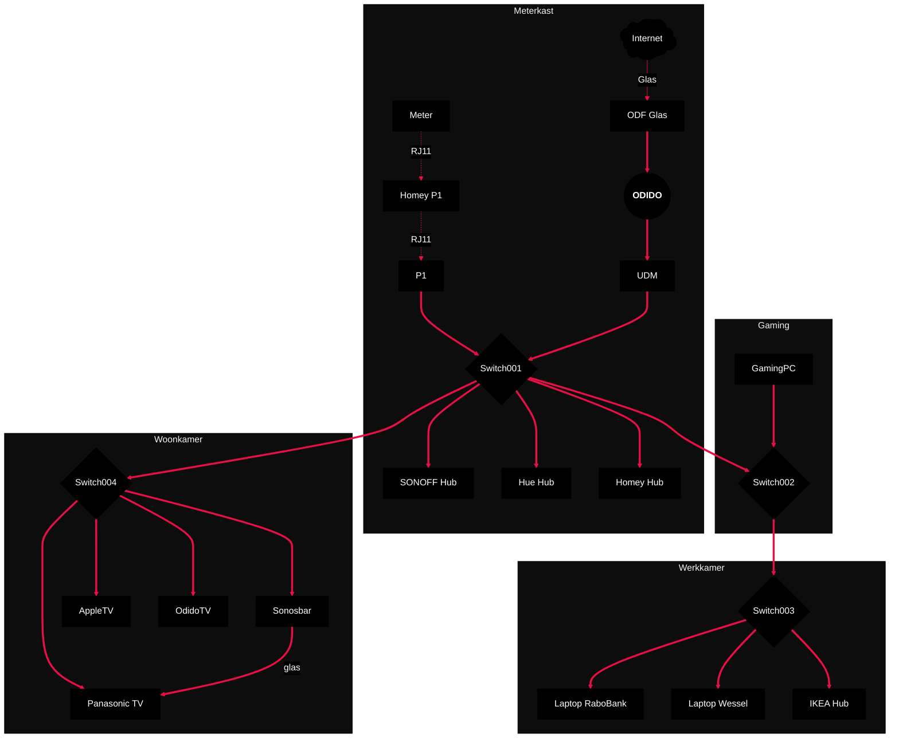

<link rel="stylesheet" href="styles.css">

# Network Layout

[Link to test](test.md)

```mermaid
  %%{init: {
    'theme': 'base',
    'themeVariables': {
      'primaryColor': '#000000',
      "primaryTextColor": "#ffffff",
      "lineColor": "#e61045"
    }
  }}%%
  graph TD
    subgraph MK[Meterkast]
      Internet@{ shape: cloud, label: "Internet"}
      ODF@{ shape: rect,  label: "ODF Glas" }
      ODIDO((("`**ODIDO**`")))
      UDM[UDM]
      Switch1{Switch001}
      Sonoff[SONOFF Hub]
      Hue[Hue Hub]
      Homey[Homey Hub]
      Meter[Meter]
      HomeyP1[Homey P1]
      P1[P1]
    end
    subgraph WK[Woonkamer]
      Switch4{Switch004}
      TV[Panasonic TV]
      SonosBar[Sonosbar]
      AppleTVWK[AppleTV]
      Odidobox[OdidoTV]
    end
    subgraph WR[Werkkamer]
      Switch3{Switch003}
      LaptopRB[Laptop RaboBank]
      LaptopWS[Laptop Wessel]
      IKEA[IKEA Hub]
    end
    subgraph GP[Gaming]
      GamePC[GamingPC]
      Switch2{Switch002}
    end
Meter -.->|RJ11| HomeyP1 -.->|RJ11| P1 ==> Switch1
Switch3 ==> LaptopRB
Switch3 ==> LaptopWS
Switch3 ==> IKEA
GamePC ==> Switch2
Switch1 ==> Switch2
Switch2 ==> Switch3
Switch1 ==> Hue
Switch1 ==> Switch4
Internet -->|Glas| ODF ==> ODIDO
ODIDO ==> UDM
UDM ==> Switch1
Switch1 ==> Sonoff
Switch1 ==> Homey
Switch4 ==> SonosBar
Switch4 ==> AppleTVWK
Switch4 ==> Odidobox
Switch4 ==> TV
SonosBar ==>|glas| TV
```
